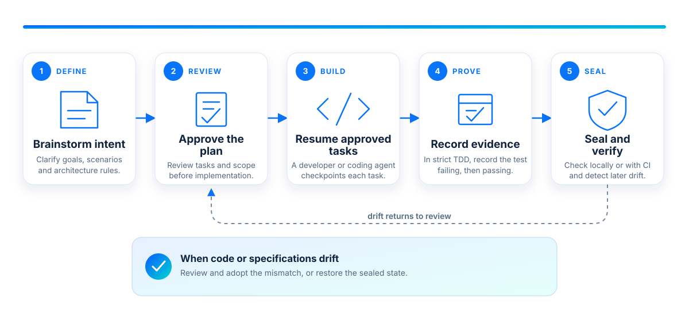

<h1 align="center">
  
</h1>

<p align="center"><strong>Give people and coding agents a shared contract for what your software should do.</strong></p>

<p align="center">
  Local-first&nbsp;&nbsp;·&nbsp;&nbsp;Model-agnostic&nbsp;&nbsp;·&nbsp;&nbsp;Git-native&nbsp;&nbsp;·&nbsp;&nbsp;Any tech stack
</p>

<p align="center">
  <a href="https://github.com/hugues31/telos-sdd/actions/workflows/ci.yml"></a>
  <a href="LICENSE"></a>
  <a href="https://www.rust-lang.org/"></a>
</p>

Telos is a local CLI that keeps requirements, scenarios, code links, and test
evidence together in Git. Review changes before implementation, give coding
agents focused context, and let configured CI detect drift from the approved
state.

Telos is written in Rust but works with any language. It makes no LLM calls,
generates no application code, and requires no hosted service.

## Why Telos?

**Tired of coding agents breaking existing behavior every time you ask for a
new feature?**

Telos is built on a simple spec-first principle: if your intent, scenarios,
constraints, and test evidence are detailed enough, a fresh agent—with no chat
history or hidden project knowledge—should be able to rebuild the software.

The specification is the durable source of truth. The current code is one
verified implementation of it.

- **Durable intent** versioned with the repository.
- **Focused context** for developers and coding agents.
- **Reviewable changes** approved before implementation.
- **Test evidence** linked to the same test failing, then passing in strict TDD
  mode.
- **Drift detection** across specifications and production code.

## How it works

<p align="center">
  
</p>

Each approved cycle is sealed against the exact Git contents, making later
drift visible.

## Quick start

Install the latest release on Linux or macOS:

```console
curl -fsSL https://raw.githubusercontent.com/hugues31/telos-sdd/main/install.sh | sh
```

On Windows PowerShell:

```powershell
irm https://raw.githubusercontent.com/hugues31/telos-sdd/main/install.ps1 | iex
```

Then initialize Telos inside an existing Git repository:

```console
cd my-project
telos init --agents claude,codex --ci github
telos status
telos check --sealed
telos view --port 3000 --open
```

Omit either initialization flag if you do not need it. `telos view --open`
launches the loopback-only view in your default web browser.

## See it in action

[Telos Tamagotchi](https://github.com/hugues31/telos-tamagotchi) shows five
complete change cycles in a small Python application. Browse its
[exported specification](https://hugues31.github.io/telos-tamagotchi/) or
replay the repository history.

<p align="center">
  <a href="https://hugues31.github.io/telos-tamagotchi/">
    
  </a>
</p>

## A typical development loop

These IDs come from the [Billing demo](demo/billing) and assume its intent and
scenario exist. Use your project's IDs; never edit `telos/` directly.

```console
# Open and stage.
telos change open "settle an invoice after payment"
printf '%s\n' '{"status":"active"}' \
  | telos edit intent INT-0042 --change CHG-0001

# Review and approve.
telos change diff CHG-0001
telos change approve CHG-0001 --expected-digest '<digest from diff>'

# Build and prove (strict TDD).
telos pack INT-0042
telos test SCN-0107
telos bind src/billing/invoice.rs INT-0042
telos test SCN-0107

# Reconcile and verify.
telos change reconcile CHG-0001
telos check --sealed
```

Staging commands accept structured input on standard input. See the
[Billing demo](demo/billing) for the complete executable protocol. Every
command also supports a stable `--json` envelope for agent and CI automation.

If `telos status` reports later drift, use `telos adopt` to capture it or
`telos revert` to restore the sealed state.

## A small mental model

| Term | Meaning |
|---|---|
| **Context** | A domain boundary that owns vocabulary and behavior. |
| **Capability** | A responsibility the context provides. |
| **Notion** | A named domain concept and its attributes. |
| **Intent** | A behavior or outcome the software must support. |
| **Scenario** | An executable example that proves an intent. |
| **Constraint** | A rule that behavior or architecture must respect. |
| **Binding** | A link from an intent to the code that implements it. |

Telos validates references, ownership, dependency direction, vocabulary, and
production-file boundaries deterministically.

## Explore and reconstruct

- `telos view --port 3000 --open` browses the current model locally and opens it
  in the default web browser.
- `telos view --export site --open` creates a self-contained static site and
  opens its index page.
- `telos rebuild plan` and `telos rebuild status` show implementation order and
  scenario progress. They do not write code.

## Reference

- [CLI contracts](docs/contracts.md): schemas, errors, and safety boundaries.
- [Billing demo](demo/billing): the complete reconstruction protocol.
- [Telos Tamagotchi](https://github.com/hugues31/telos-tamagotchi): a replayable
  Python example.
- [Releases](https://github.com/hugues31/telos-sdd/releases): prebuilt archives.

Git must be available on `PATH`. Generated CI also requires a published Telos
binary release and separately configured branch protection.

<details>
<summary><strong>Build from source</strong></summary>

Requires stable Rust and Node.js 22:

```console
git clone https://github.com/hugues31/telos-sdd.git
cd telos-sdd/frontend
npm ci
npm run build
cd ..
cargo install --locked --path crates/telos
```

</details>

## Developing Telos

```console
cargo fmt --all --check
cargo clippy --workspace --all-targets -- -D warnings
cargo test --workspace
cargo test -p telos --test rebuild_demo
```

CI runs on Linux, macOS, and Windows.

## License

[MIT](LICENSE) © 2026 Hugues Gaillard.
